# Practica-Grupal-PLSQL
Práctica grupal de PL/SQL realizada por Iván, Felipe, Alfonso y David.

## Descripción

Se adjuntan los siguientes cinco documentos:

- a) Descripción del problema. (Fase 1)

- b) Esquema de las tablas que tendréis que utilizar (Fase 2)

- c) Dos scripts para la creación de las tablas y la inserción de registros tanto en ORACLE como en Postgres (los originales contenían errores, pero ya están solucionados)

- d) El enunciado real de la práctica. (Fase 4)

Se realizarán los ocho ejercicios en ORACLE y dos de ellos se harán también en Postgres.


## Ejercicio 1

### Enunciado

Realiza una función que reciba un **código de comunidad** y un **código de propiedad** y, en caso de que se trate de un local nos devuelva un **1** si está abierto o un **0** si está cerrado en el momento de la ejecución de la función. Debes contemplar las siguientes excepciones: **Comunidad Inexistente**, **Propiedad Inexistente** en esa Comunidad, La propiedad **no es un local comercial**.

### Comprobaciones

 - Se comprobará que funcionen todas las excepciones pedidas.
 - Se comprobará que da como resultado cerrado o abierto segun el horario. El horario mas tarde es a las 20:00, recomiendo hacer el siguiente insert para tener un local abierto todo el día y realizar las pruebas necesarias.

```sql
INSERT INTO horarios_apertura VALUES('AAAA1','0002','Lunes',TO_DATE('08:00','HH24:MI'),TO_DATE('22:54','HH24:MI'));
```

### Prueba de funcionamiento

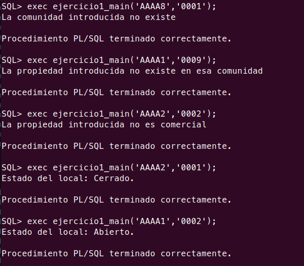


## Ejercicio 2

### Enunciado

Realiza un procedimiento llamado **MostrarInformes**, que recibirá tres parámetros, siendo el primero de ellos un
número que indicará el tipo de informe a mostrar. Estos tipos pueden ser los siguientes:

**Informe Tipo 1:** Informe de cargos. Este informe recibe como segundo parámetro el código de una comunidad y
como tercer parámetro una fecha, mostrando la junta directiva que tenía dicha comunidad en esa fecha con el
siguiente formato:

```
INFORME DE CARGOS
Comunidad: NombreComunidad
PoblaciónComunidad CodPostalComunidad
Fecha: xx/xx/xx
PRESIDENTE D.xxxxxx xxxxxxxxx xxxxxxxxxx Teléfono
VICEPRESIDENTE D.xxxxxxxxxx xxxxxxxxx xxxxxxxxxx Teléfono
SECRETARIO D. xxxxxxxxx xxxxxxxxxxx xxxxxxxxxxx Teléfono
VOCALES:
    D. xxxxxxxxxx xxxxxxxxxxx xxxxxxxxxxxx Teléfono
    D. xxxxxxxxxx xxxxxxxxxxx xxxxxxxxxxxx Teléfono
….
Número de Directivos: nn
```

**Informe Tipo 2:** Informe de Recibos Impagados. El segundo parámetro será un código de comunidad y el tercer parámetro estará en blanco. El informe muestra los recibos impagados, de forma que salgan en primer lugar los propietarios que adeudan un mayor importe.

```
INFORME DE RECIBOS IMPAGADOS

Comunidad: NombreComunidad

PoblaciónComunidad CodPostalComunidad

Fecha: xx/xx/xx

Propietario 1: D.xxxxxxxxxx xxxxxxxxxx xxxxxxxxxx
        NumRecibo1      FechaRecibo1        Importe1
        …
        NumReciboN      FechaReciboN        ImporteN
Total Adeudado D. xxxxx xxxxxxxxxx xxxxxxxxx: n,nnn.nn

Propietario 2: D. xxxxxxxxxx xxxxxxxxxx xxxxxxxxxx
        NumRecibo1      FechaRecibo1         Importe1
        …
        NumReciboN      FechaReciboN        ImporteN
Total Adeudado D. xxxxx xxxxxxxxxx xxxxxxxxx: n,nnn.nn
…

Total Adeudado en la Comunidad: nnn,nnn.nn
```

**Informe Tipo 3:** Informe de Propiedades. Para este informe el segundo parámetro será un código de comunidad y el tercero estará en blanco. Se mostrará ordenado por el porcentaje de participación total que corresponda a cada propietario. En el caso de que la prpiedad tenga un inquilino se mostrarán su nombre y apellidos. Tendrá el siguiente formato:

```
INFORME DE PROPIEDADES
Comunidad: NombreComunidad
PoblaciónComunidad CodPostalComunidad
Propietario1: D.xxxxxxxxxx xxxxxx xxxxxxxx
        CodPropiedad1   TipoPropiedad1  Portal  Planta  Letra   PorcentajeParticipación1    Inquilino1
        …
        CodPropiedadN   TipoPropiedadN  Portal  Planta  Letra   PorcentajeParticipaciónN    InquilinoN

Porcentaje de Participación Total Propietario1: nn,nn %
Propietario2: D. xxxxx xxxxxxxx xxxxxxxxxx
…
```

### Prueba de funcionamiento

**Informe Tipo 1:** Informe de cargos.

Este informe se compone de 4 procedimientos que son los siguientes:
  
  1. **Procedimiento principal:** Será el encargado de llamar los otros procedimientos y de mostrar el resultado final.
  
  2. **Procedimiento para comprobar excepciones:** En este se realizará comprobaciones que harán saltar algunos raise si los datos no son correctos.
 
  3. **Procedimiento "infocomunidad" y "datosdirectivas":** Estos dos procedimientos se encargan de recolectar la información requerida para mostrar los datos de la comunidad y del equipo directivo.

Por último debo mencionar que en el enunciado se pide mostrar en el informe un campo llamado "Secretarios". Este campo no se menciona en ningún momento en el enunciado de la fase 1, tampoco aparece en el diagrama de la fase 2, y ninguna tabla contiene información respecto a este puesto de la junta directiva. Al ser un campo que no existe y nunca mostraría información he preferido eliminarlo directamente del informe.

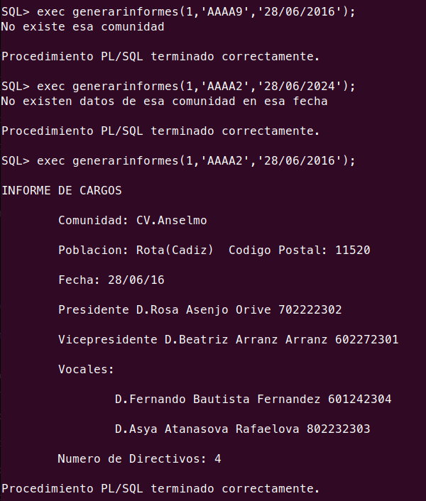

**Informe Tipo 2:** Informe de Recibos Impagados.

***Nota**: La fecha que devuelve no es la introducida ya que no lee ese parámetro. Devuelve la fecha actual (función **devolver_fecha_actual**).

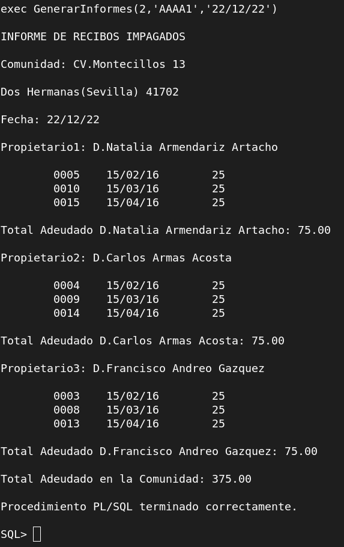

**Informe Tipo 3:** Informe de Propiedades.

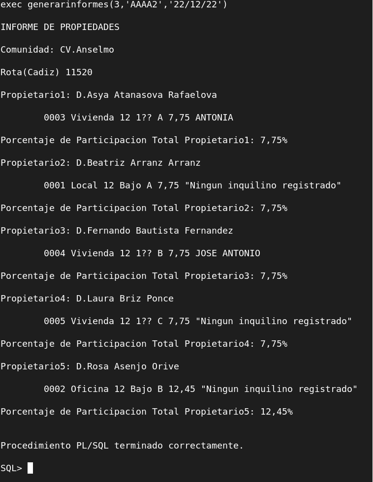


## Ejercicio 3

### Enunciado

Realiza los módulos de programación necesarios para que los honorarios anuales correspondientes a un contrato de mandato vayan en función del número de propiedades de la comunidad y de la existencia o no de locales y oficinas, de acuerdo con la siguiente tabla:


| Num Propiedades | Honorarios Anuales |
|:---------------:|:------------------:|
|       1-5       |         600        |
|       6-10      |        1000        |
|      11-20      |        1800        |
|       >20       |        2500        |

### Prueba de funcionamiento

Select de la tabla **CONTRATOS_DE_MANDATO** antes de ejecutar el procedimiento que actualiza los datos:


Select de la tabla **CONTRATOS_DE_MANDATO** después de ejecutar el procedimiento que actualiza los datos:

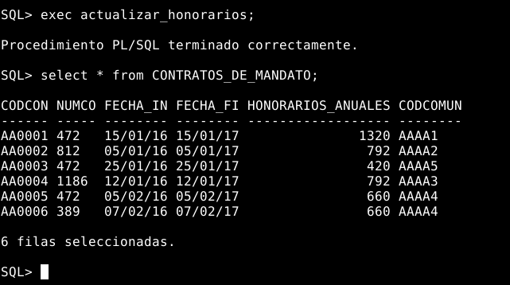

#### Comprobaciónes de que el trigger funciona correctamente:

**1º Comprobación**

- Primero se ha insertado un registro que debe de dar un error, ya que no se ha cumplido la condición del trigger.
- Luego se ha insertado un registro que sí cumple la condición del trigger.
- Por último se ha comprobado que el último registro insertado se ha insertado correctamente mediante un select de la tabla **CONTRATOS_DE_MANDATO**.

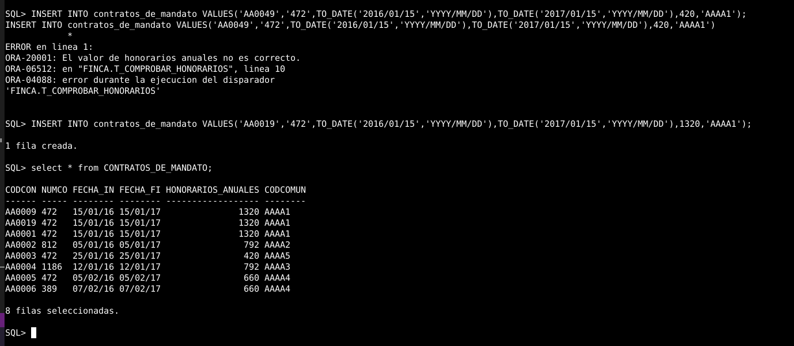

**2º Comprobación**

- Primero se ha hecho un select para ver el número de propiedades, locales y oficinas de las comunidades.
- Luego se ha insertado un registro de una comunidad que no tiene propiedades, locales ni oficinas.
- Por último se ha hecho un select de la tabla CONTRATOS_DE_MANDATO para comprobar que el registro se ha insertado correctamente.

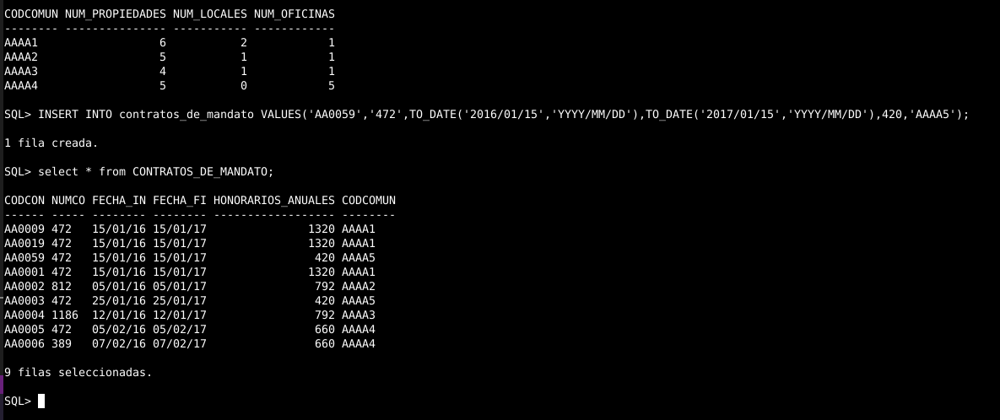

### Prueba de funcionamiento (Ejercicio 3 - PostgreSQL)

Select de la tabla **CONTRATOS_DE_MANDATO** antes de ejecutar el procedimiento que actualiza los datos:

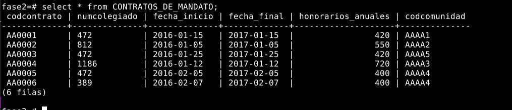

Select de la tabla **CONTRATOS_DE_MANDATO** después de ejecutar el procedimiento que actualiza los datos:


#### Comprobaciónes de que el trigger funciona correctamente:

**1º Comprobación**

- Se ha insertado un registro que debe de dar un error, ya que no se ha cumplido la condición del trigger.

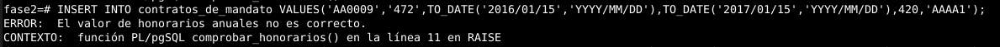

**2º Comprobación**

- Primero se ha insertado un registro que sí cumple la condición del trigger.
- Luego se ha hecho un select de la tabla CONTRATOS_DE_MANDATO para comprobar que el registro se ha insertado correctamente.

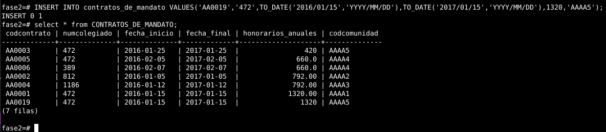


## Ejercicio 4

### Enunciado

Realiza los módulos de programación necesarios para que cuando se abone un recibo que lleve más de un año impagado se avise por correo electrónico al presidente de la comunidad y al administrador que tiene un contrato de mandato vigente con la comunidad correspondiente. Añade el campo e-mail tanto a la tabla Propietarios como Administradores.

### Prueba de funcionamiento

En la parte superior de la siguiente imagen podemos ver como insertamos un registro en **Recibos_cuotas** donde la fecha tiene **más de un año de antiguedad** y el valor **"Pagado"** es **"No"**. Con esto haremos disparar el trigger que notificara por correo, en este caso, a los usuarios **"Rosa"** (Presidenta) y **"adminjosemanuel"** (Administrador) de la comunidad.

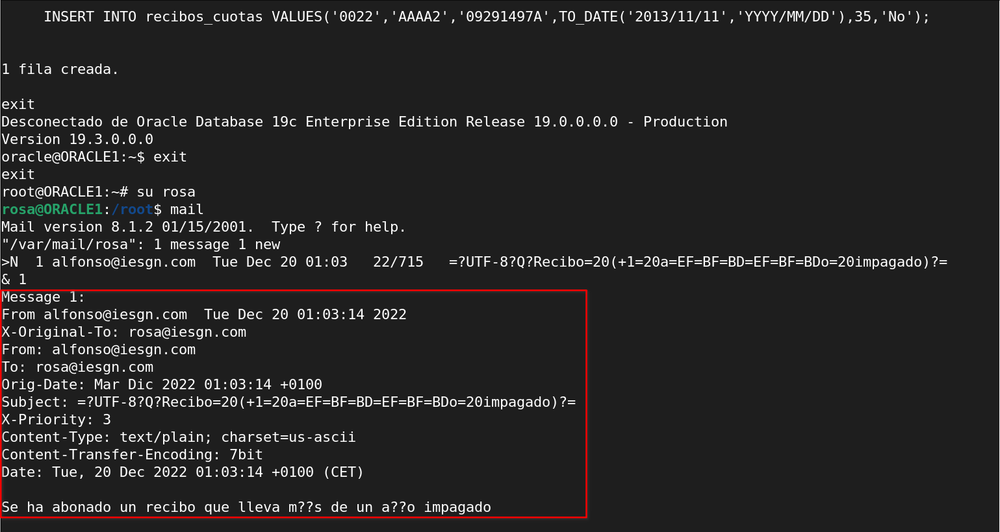

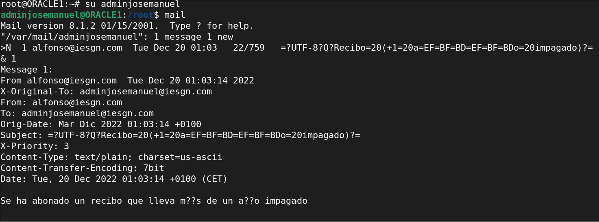

Como vemos, ambos usuarios han recibido el email.

Ahora revisaremos los logs del servidor de correos para comprobar como realmente se ha enviado el correo a dichos usuarios.

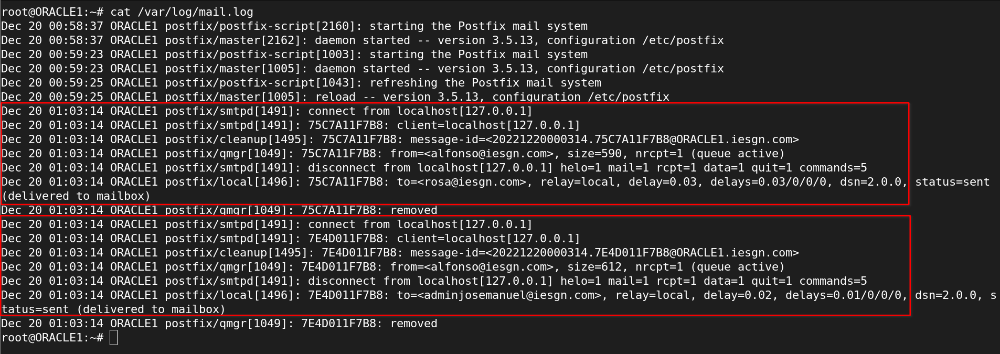


## Ejercicio 5

### Enunciado

Añade una columna ImportePendiente en la columna Propietarios y rellénalo con la suma de los importes de los recibos pendientes de pago de cada propietario. Realiza los módulos de programación necesarios para que los datos de la columna sean siempre coherentes con los datos que se encuentran en la tabla Recibos.

### Prueba de funcionamiento

En este caso insertaré algunos registros en la tabla **recibos_cuotas**, seleccionando el valor del campo **"Pagado"** a **"No"** y añadiendo el DNI de algún propietario que tenga el valor **0** en la columna **"ImportePendiente"** en este caso (Luisa).

Inserción de datos (Tabla Recibos_cuotas).

```sql
INSERT INTO recibos_cuotas VALUES('0016','AAAA1','K6022994B',TO_DATE('2016/02/15','YYYY/MM/DD'),25,'No');
INSERT INTO recibos_cuotas VALUES('0017','AAAA1','K6022994B',TO_DATE('2016/02/15','YYYY/MM/DD'),25,'No');
```

Realizamos la siguiente consulta y podremos ver como Luisa tiene el valor **50** en la columna **"ImportePendiente"** (Tabla Propietarios).

```sql
select nombre, dni, importependiente from propietarios where dni='K6022994B';
```

Por último, borraremos los registros anteriores (Tabla **Recibos_cuotas**) y volveremos a realizar la consulta anterior para comprobar como "Luisa" tiene el valor 0 en la columna **"ImportePendiente"** (Tabla **Propietarios**). 

```sql
DELETE FROM RECIBOS_CUOTAS WHERE NUMRECIBO=0016;
DELETE FROM RECIBOS_CUOTAS WHERE NUMRECIBO=0017;
```


Como vemos se sincronizan los cambios en ambas tablas, por lo que los datos de la columna **"ImportePendiente"** se mantienen coherentes con los datos que se encuentran en la tabla **Recibos_cuotas**.


### Prueba de funcionamiento (Ejercicio 5 - PostgreSQL)

- En este caso insertaremos algunos registros en la tabla **recibos_cuotas**, seleccionando el valor del campo **"Pagado"** a **"No"** y añadiendo el DNI de algún propietario que tenga el valor **0** en la columna **"ImportePendiente"** en este caso (Luisa):

- Insercción de datos.
```sql
INSERT INTO recibos_cuotas VALUES('0016','AAAA1','K6022994B',TO_DATE('2016/02/15','YYYY/MM/DD')::date,30,'No');
INSERT INTO recibos_cuotas VALUES('0017','AAAA1','K6022994B',TO_DATE('2016/02/15','YYYY/MM/DD')::date,30,'No');
```


- Realizamos las siguientes consultas y podremos ver como Luisa tiene el valor 50 en la columna **"ImportePendiente"**.
```sql
select * from recibos_cuotas;
select nombre, dni, importependiente from propietarios where dni='K6022994B';
```
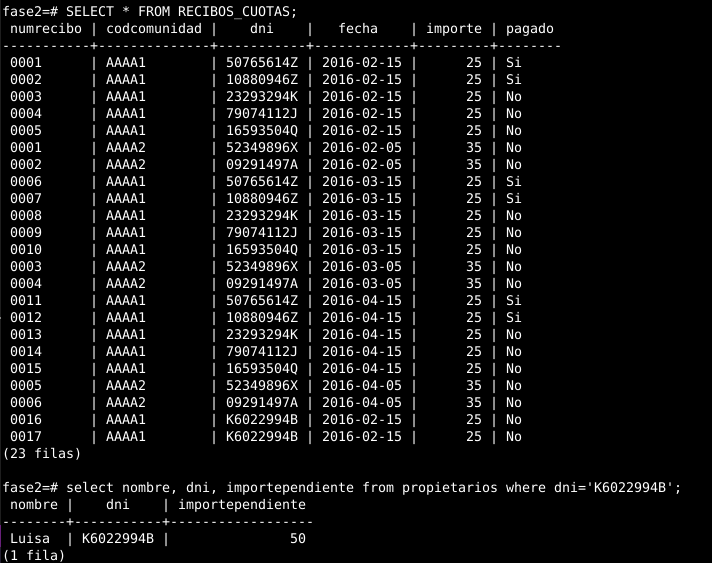


## Ejercicio 6

### Enunciado

Realiza los módulos de programación necesarios para evitar que un propietario pueda ocupar dos cargos diferentes en la misma comunidad de forma simultánea.

### Prueba de funcionamiento

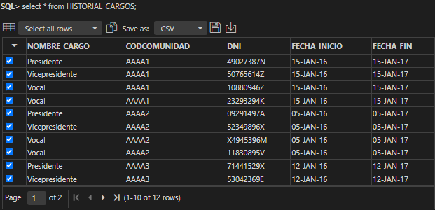

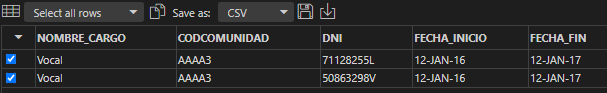

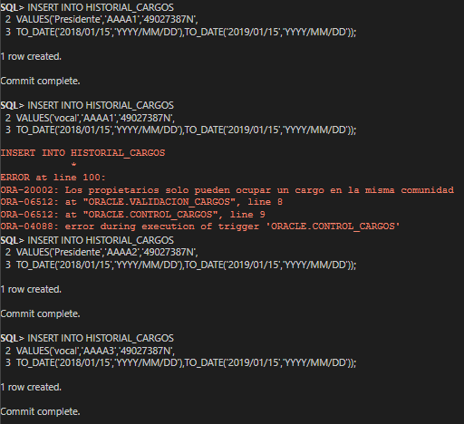

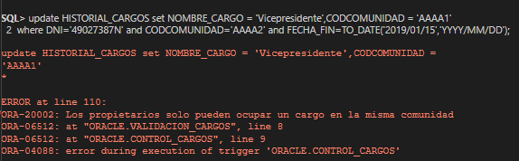

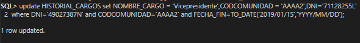


## Ejercicio 7

### Enunciado

Realiza los módulos de programación necesarios para evitar que un administrador gestione más de cuatro comunidades de forma simultánea.

### Prueba de funcionamiento

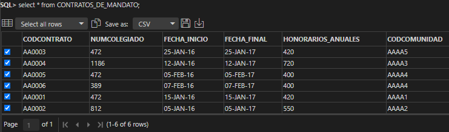

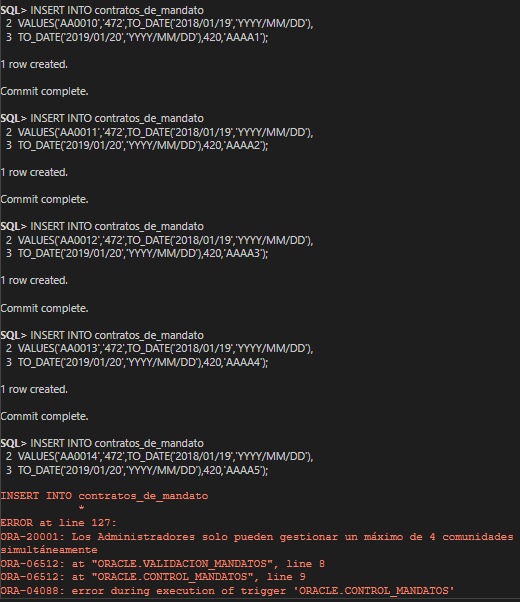

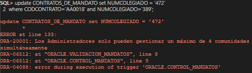

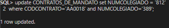


## Ejercicio 8

### Enunciado

Realiza los módulos de programación necesarios para evitar que se emitan dos recibos a un mismo propietario en menos de 30 días.

### Prueba de funcionamiento

#### Comprobación de que el trigger funciona correctamente:

- Primero se ha insertado un registro que no cumple la condición del trigger y da un error.
- Luego se ha insertado un registro que sí cumple la condición del trigger.
- Después se ha insertado un registro que no cumple la condición del trigger y da un error.

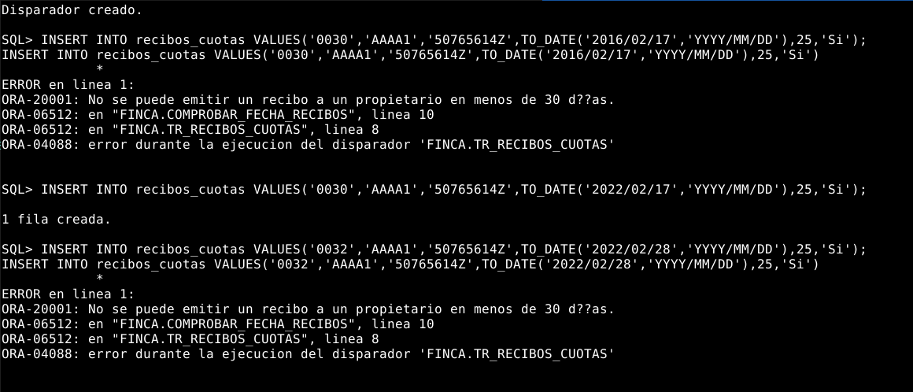

#### En esta imagen se puede ver que el registro que antes se insertó correctamente:

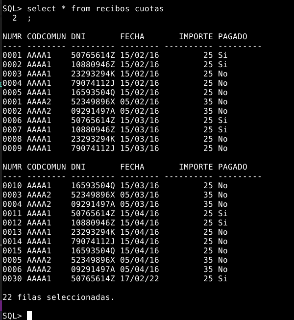

#### En esta imagen se puede ver como elimino todos los registros de la tabla RECIBOS_CUOTAS para poder insertarlos de nuevo:

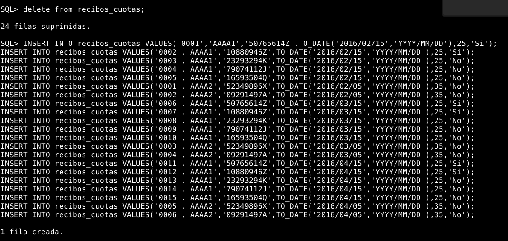

#### En esta imagen se puede ver otra comprobación del trigger en la cual se ve que no todos los registros se han insertado correctamente debido a que no cumplen la condición del trigger:

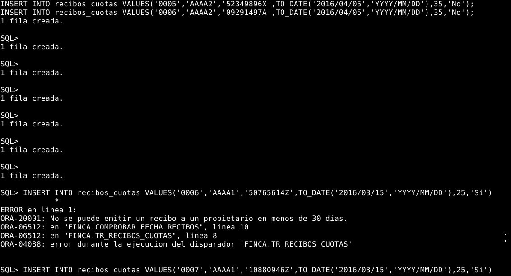

#### En esta imagen se puede ver mediante un select de la tabla RECIBOS_CUOTAS los registros que se han insertado correctamente:

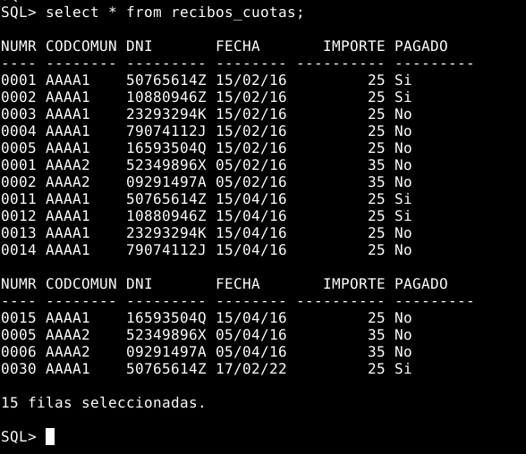

#### Mas comprobaciones del trigger:

- Primero he tratado de insertar un registro que no cumple la condición del trigger y da un error, esto es debido a que el trigger cuenta los días desde la fecha de emisión del último recibo del propietario y deben pasar exactamente 30 días. Del día 15 de febrero al 16 de marzo hay 29 días, por lo que no se cumple la condición del trigger.
- Luego he insertado un registro que sí cumple la condición del trigger. En este caso sí han pasado 30 días desde la fecha de emisión del último recibo del propietario.


#### En esta imagen se puede ver que el registro que antes se insertó correctamente:

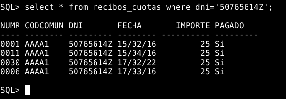
