# Practica-Grupal-PLSQL
Práctica grupal de PL/SQL realizada por Iván, Felipe, Alfonso y David.
## Descripción

Se adjuntan los siguientes cinco documentos:

- a) Descripción del problema. (Fase 1)

- b) Esquema de las tablas que tendréis que utilizar (Fase 2)

- c) Dos scripts para la creación de las tablas y la inserción de registros tanto en ORACLE como en Postgres (los originales contenían errores, pero ya están solucionados)

- d) El enunciado real de la práctica. (Fase 4)

Se realizarán los ocho ejercicios en ORACLE y dos de ellos se harán también en Postgres.

# Enunciado Ejercicio 1: Realiza una función que reciba un código de comunidad y un código de propiedad y, en caso de que se trate de un local nos devuelva un 1 si está abierto o un 0 si está cerrado en el momento de la ejecución de la función. Debes contemplar las siguientes excepciones: Comunidad Inexistente, Propiedad Inexistente en esa Comunidad, La propiedad no es un local comercial.

## Comprobaciones del ejercicio 1:
 - Se comprobará que funcionen todas las excepciones pedidas.
 - Se comprobará que da como resultado cerrado o abierto segun el horario. El horario mas tarde es a las 20:00, recomiendo hacer el siguiente insert para tener un local abierto todo el día y realizar las pruebas necesarias.
```sql
INSERT INTO horarios_apertura VALUES('AAAA1','0002','Lunes',TO_DATE('08:00','HH24:MI'),TO_DATE('22:54','HH24:MI'));
```
## Captura con todas las pruebas mencionadas anteriormente.
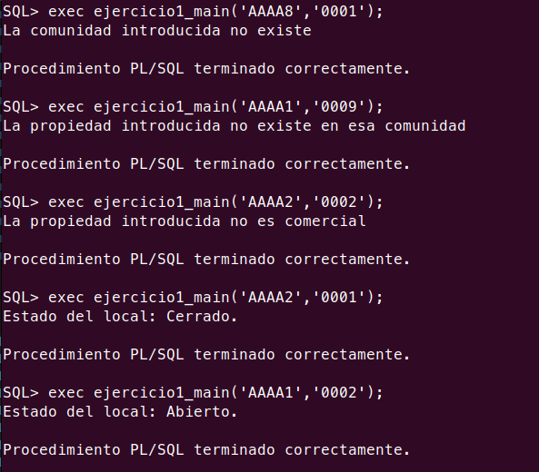

# Enunciado Ejercicio 2: Realiza un procedimiento llamado MostrarInformes, que recibirá tres parámetros, siendo el primero de ellos un número que indicará el tipo de informe a mostrar. Estos tipos pueden ser los siguientes:

## Informe Tipo 1: Informe de cargos. Este informe recibe como segundo parámetro el código de una comunidad y como tercer parámetro una fecha, mostrando la junta directiva que tenía dicha comunidad en esa fecha con el siguiente formato:

### Comprobaciones del informe tipo 1:
 - Este informe se compone de 4 procedimientos que son los siguientes:
  1. Procedimiento principal: Será el encargado de llamar los otros procedimientos y de mostrar el resultado final.
  2. Procedimiento para comprobar excepciones: En este se realizará comprobaciones que harán saltar algunos raise si los datos no son correctos.
  3. Procedimiento "infocomunidad" y "datosdirectivas": Estos dos procedimientos se encargan de recolectar la información requerida para mostrar los datos de la comunidad y del equipo directivo.
 - Por último debo mencionar que en el enunciado se pide mostrar en el informe un campo llamado "Secretarios". Este campo no se menciona en ningún momento en el enunciado de la fase 1, tampoco aparece en el diagrama de la fase 2, y ninguna tabla contiene información respecto a este puesto de la junta directiva. Al ser un campo que no existe y nunca mostraría información he preferido eliminarlo directamente del informe.

### Captura donde se ve el funcionamiento de las excepciones y el resultado del informe.

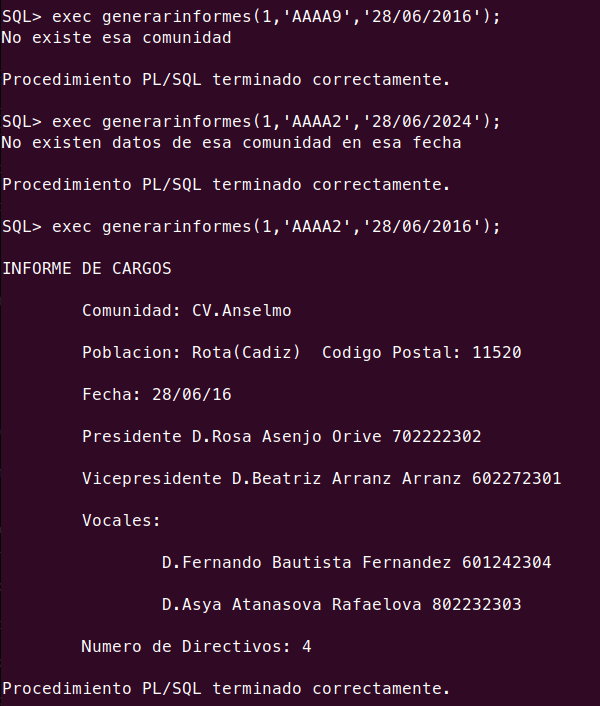

# Enunciado Ejercicio 3:
## Realizar un trigger que actualice los honorarios anuales de un contrato de mandato de acuerdo a lo siguiente:
- Si el número de Propiedades de la comunidad a la que pertenece el contrato de mandato es de 1 a 5, los Honorarios Anuales serán de 600
- Si el número de Propiedades de la comunidad a la que pertenece el contrato de mandato es de 6 a 10, los Honorarios Anuales serán de 1000
- Si el número de Propiedades de la comunidad a la que pertenece el contrato de mandato es de 11 a 20, los Honorarios Anuales serán de 1800
- Si el número de Propiedades de la comunidad a la que pertenece el contrato de mandato es mayor de 20, los Honorarios Anuales serán de 2500
- La existencia de locales en la comunidad a la que pertenece el contrato de mandato incrementará en un 20% los honorarios 
- La existencia de oficinas en la comunidad a la que pertenece el contrato de mandato incrementará en un 10% los honorarios

## Select de la tabla CONTRATROS_DE_MANDATO antes de ejecutar el procedimiento que actualiza los datos:
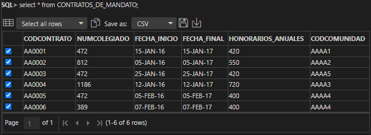

## Select de la tabla CONTRATROS_DE_MANDATO después de ejecutar el procedimiento que actualiza los datos:
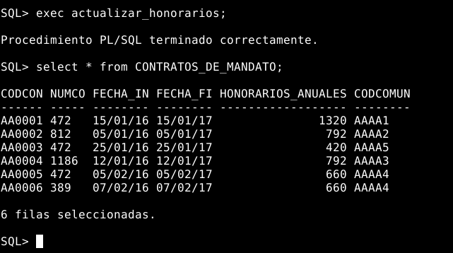

## Comprobación de que el trigger funciona correctamente:
- Primero se ha insertado un registro que debe de dar un error, ya que no se ha cumplido la condición del trigger.
- Luego se ha insertado un registro que sí cumple la condición del trigger.
- Por último se ha comprobado que el último registro insertado se ha insertado correctamente mediante un select de la tabla CONTRATOS_DE_MANDATO.
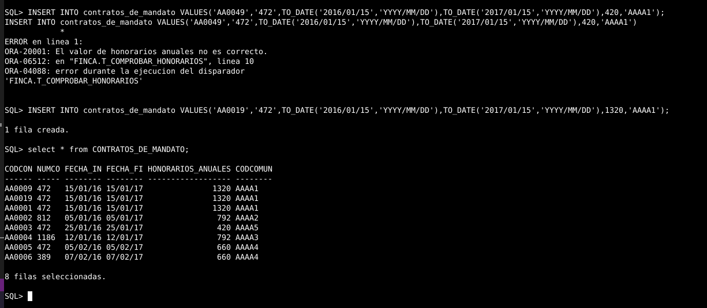

## En esta imagen se puede ver otra comprobación del trigger:
- Primero se ha hecho un select para ver el número de propiedades, locales y oficinas de las comunidades.
- Luego se ha insertado un registro de una comunidad que no tiene propiedades, locales ni oficinas.
- Por último se ha hecho un select de la tabla CONTRATOS_DE_MANDATO para comprobar que el registro se ha insertado correctamente.
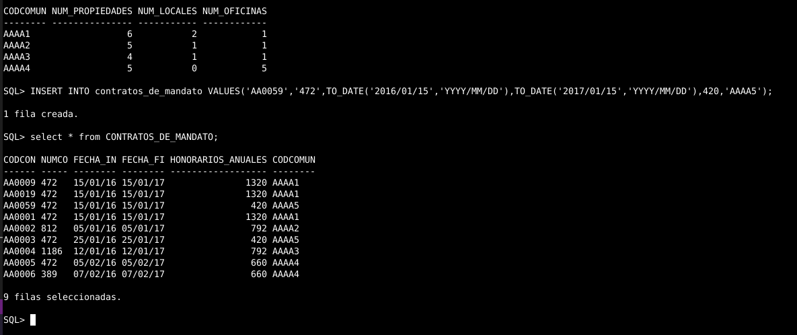


# Enunciado Ejercicio 3 hecho en PostgreSQL:
## Realizar un trigger que actualice los honorarios anuales de un contrato de mandato de acuerdo a lo siguiente:
- Si el número de Propiedades de la comunidad a la que pertenece el contrato de mandato es de 1 a 5, los Honorarios Anuales serán de 600
- Si el número de Propiedades de la comunidad a la que pertenece el contrato de mandato es de 6 a 10, los Honorarios Anuales serán de 1000
- Si el número de Propiedades de la comunidad a la que pertenece el contrato de mandato es de 11 a 20, los Honorarios Anuales serán de 1800
- Si el número de Propiedades de la comunidad a la que pertenece el contrato de mandato es mayor de 20, los Honorarios Anuales serán de 2500
- La existencia de locales en la comunidad a la que pertenece el contrato de mandato incrementará en un 20% los honorarios 
- La existencia de oficinas en la comunidad a la que pertenece el contrato de mandato incrementará en un 10% los honorarios

## Select de la tabla CONTRATROS_DE_MANDATO antes de ejecutar el procedimiento que actualiza los datos:
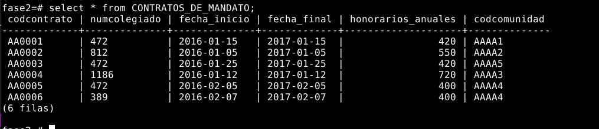

## Select de la tabla CONTRATROS_DE_MANDATO después de ejecutar el procedimiento que actualiza los datos:
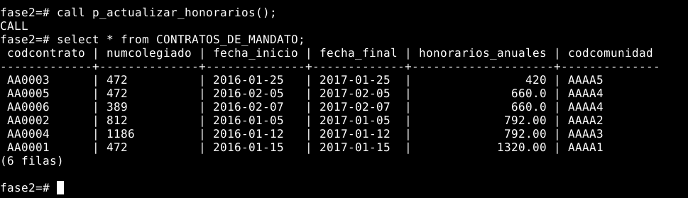

## Comprobación de que el trigger funciona correctamente:
- Se ha insertado un registro que debe de dar un error, ya que no se ha cumplido la condición del trigger.
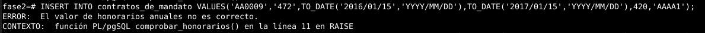

## En esta imagen se puede ver otra comprobación del trigger:
- Primero se ha insertado un registro que sí cumple la condición del trigger.
- Luego se ha hecho un select de la tabla CONTRATOS_DE_MANDATO para comprobar que el registro se ha insertado correctamente.
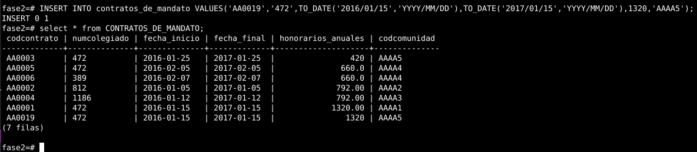


# Enunciado Ejercicio 8:
## Realiza los módulos de programación necesarios para evitar que se emitan dos recibos a un mismo propietario en menos de 30 días.

## Comprobación de que el trigger funciona correctamente:
- Primero se ha insertado un registro que no cumple la condición del trigger y da un error.
- Luego se ha insertado un registro que sí cumple la condición del trigger.
- Después se ha insertado un registro que no cumple la condición del trigger y da un error.
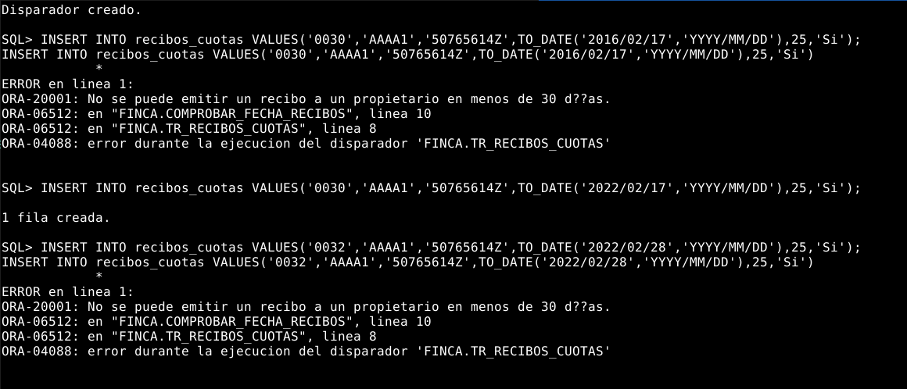

## En esta imagen se puede ver que el registro que antes se insertó correctamente:
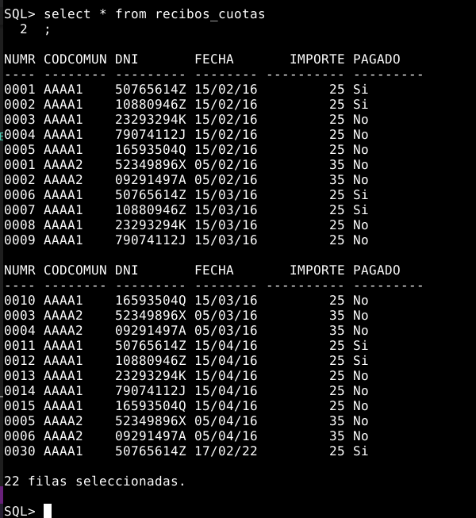

## En esta imagen se puede ver como elimino todos los registros de la tabla RECIBOS_CUOTAS para poder insertarlos de nuevo:
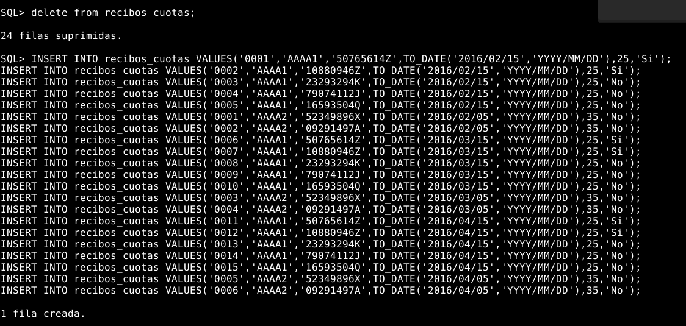

## En esta imagen se puede ver otra comprobación del trigger en la cual se ve que no todos los registros se han insertado correctamente debido a que no cumplen la condición del trigger:
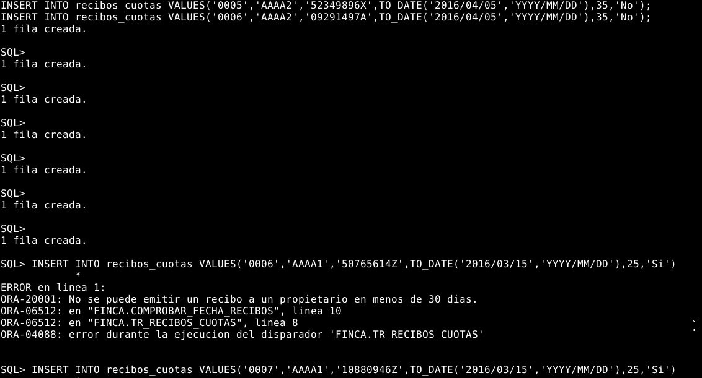

## En esta imagen se puede ver mediante un select de la tabla RECIBOS_CUOTAS los registros que se han insertado correctamente:


## Mas comprobaciones del trigger:
- Primero he tratado de insertar un registro que no cumple la condición del trigger y da un error, esto es debido a que el trigger cuenta los días desde la fecha de emisión del último recibo del propiertario y deben pasar exactamente 30 días. Del día 15 de febrero al 16 de marzo hay 29 días, por lo que no se cumple la condición del trigger.
- Luego he insertado un registro que sí cumple la condición del trigger. En este caso sí han pasado 30 días desde la fecha de emisión del último recibo del propietario.
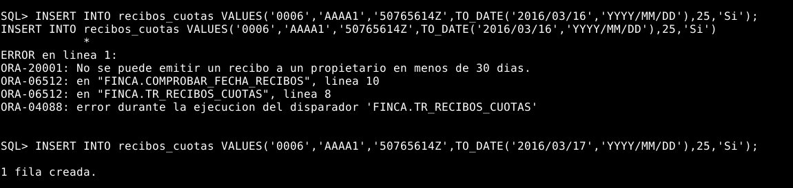

## En esta imagen se puede ver que el registro que antes se insertó correctamente:
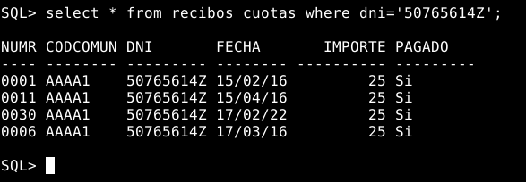
